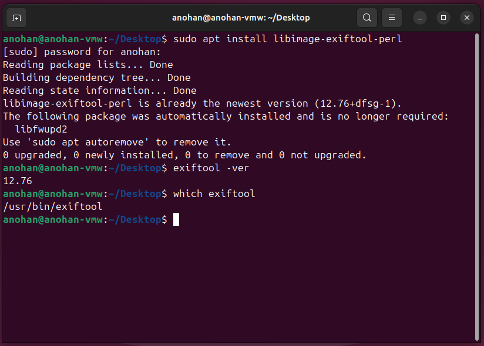
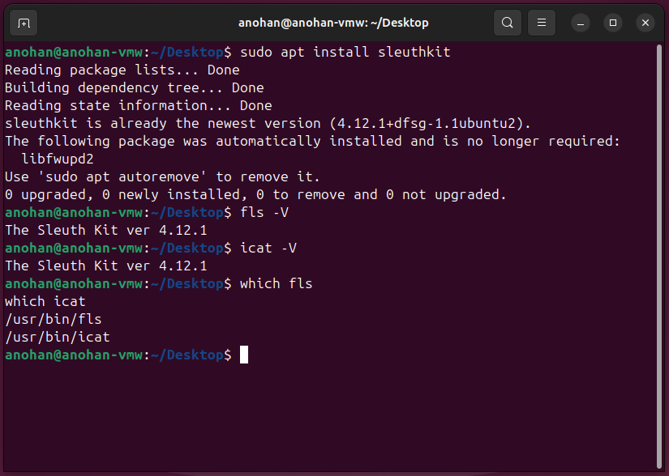
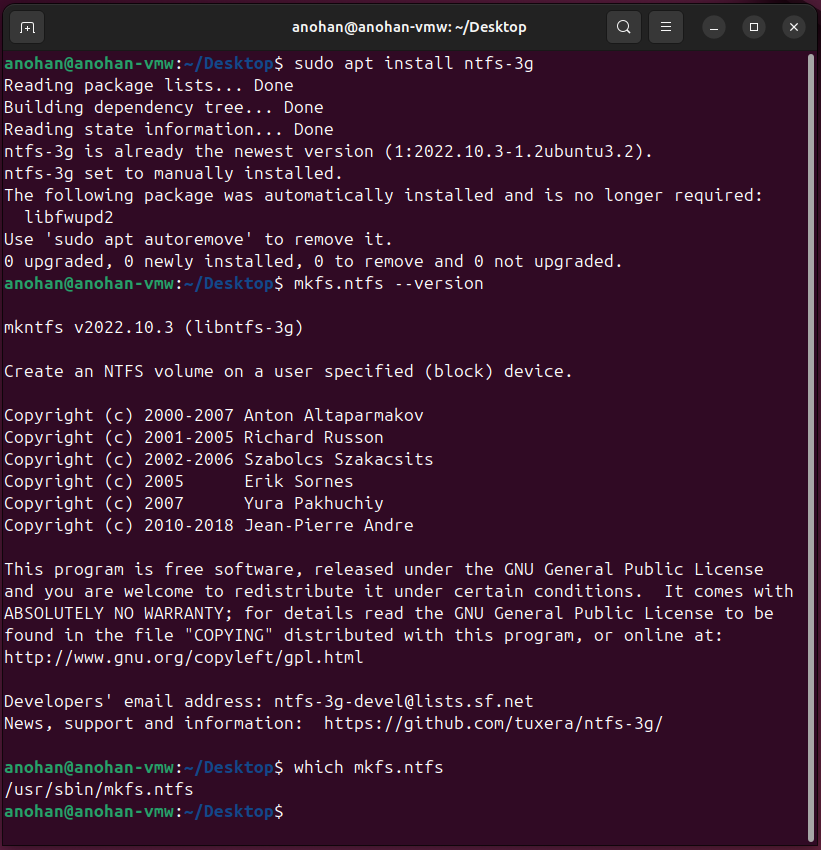
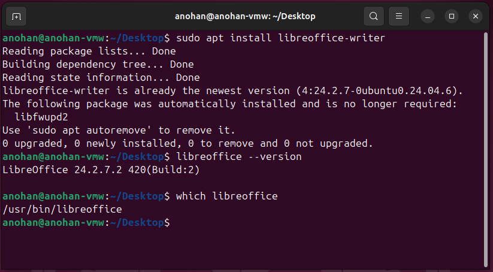

# Environment Setup Evidence

This section documents the preparation of the Ubuntu virtual machine and verification of the forensic tools used throughout the **Digital Forensics Metadata and File Carving Lab**.

The environment was configured to support metadata examination, filesystem analysis, deleted-file identification, file recovery, and evidence integrity verification.

---

## Step 1 — ExifTool Installation and Verification

ExifTool was installed on the Ubuntu virtual machine to support metadata extraction and analysis of digital evidence.

### Installation

The following command was used to install ExifTool:

```bash
sudo apt install libimage-exiftool-perl
```

The Ubuntu package manager confirmed that `libimage-exiftool-perl` was installed and up to date.

### Version Verification

The installed ExifTool version was verified using:

```bash
exiftool -ver
```

The system reported:

```text
12.76
```

**Installed version:** `12.76`

### Executable Verification

The location of the ExifTool executable was verified using:

```bash
which exiftool
```

The system returned:

```text
/usr/bin/exiftool
```

**Executable path:** `/usr/bin/exiftool`

### Evidence



### Analyst Note

ExifTool was successfully installed and verified on the Ubuntu virtual machine. It is used later in this lab to extract and examine metadata from PDF and JPEG evidence files.

---

## Step 2 — The Sleuth Kit Installation and Verification

The Sleuth Kit was installed on the Ubuntu virtual machine to support filesystem-level forensic analysis and deleted-file recovery.

### Installation

The following command was used to install The Sleuth Kit:

```bash
sudo apt install sleuthkit
```

The Ubuntu package manager confirmed that `sleuthkit` was installed and up to date.

### Version Verification

The `fls` and `icat` forensic utilities were verified using:

```bash
fls -V
icat -V
```

Both utilities reported:

```text
The Sleuth Kit ver 4.12.1
```

**Installed version:** `4.12.1`

### Executable Verification

The locations of the `fls` and `icat` executables were verified using:

```bash
which fls
which icat
```

The system returned:

```text
/usr/bin/fls
/usr/bin/icat
```

### Evidence



### Analyst Note

The Sleuth Kit was successfully installed and verified on the Ubuntu virtual machine. The `fls` utility is used later to examine the NTFS filesystem image and identify a deleted file entry. The `icat` utility is then used to recover the deleted file's contents directly from the forensic image.

---

## Step 3 — NTFS Tools Installation and Verification

The NTFS-3G utilities were verified on the Ubuntu virtual machine to provide support for creating and working with NTFS filesystems during the forensic recovery portion of the lab.

### Installation

The following command was used to verify that the NTFS-3G package was installed:

```bash
sudo apt install ntfs-3g
```

The Ubuntu package manager confirmed that `ntfs-3g` was installed and up to date.

### Version Verification

The `mkfs.ntfs` utility was verified using:

```bash
mkfs.ntfs --version
```

The system reported:

```text
mkntfs v2022.10.3 (libntfs-3g)
```

**Installed version:** `2022.10.3`

### Executable Verification

The location of the `mkfs.ntfs` executable was verified using:

```bash
which mkfs.ntfs
```

The system returned:

```text
/usr/sbin/mkfs.ntfs
```

**Executable path:** `/usr/sbin/mkfs.ntfs`

### Evidence



### Analyst Note

The NTFS-3G utilities provide support for creating and interacting with NTFS filesystems in Linux. Later in the lab, `mkfs.ntfs` is used to format a controlled disk image as NTFS so that a deleted-file recovery scenario can be examined with The Sleuth Kit.

---

## Step 4 — LibreOffice Writer Installation and Verification

LibreOffice Writer was verified on the Ubuntu virtual machine to support the creation of controlled document evidence for metadata analysis.

### Installation

The following command was used to verify that LibreOffice Writer was installed:

```bash
sudo apt install libreoffice-writer
```

The Ubuntu package manager confirmed that `libreoffice-writer` was installed and up to date.

### Version Verification

The installed LibreOffice version was verified using:

```bash
libreoffice --version
```

The system reported:

```text
LibreOffice 24.2.7.2 420(Build:2)
```

**Installed version:** `24.2.7.2`

### Executable Verification

The location of the LibreOffice executable was verified using:

```bash
which libreoffice
```

The system returned:

```text
/usr/bin/libreoffice
```

**Executable path:** `/usr/bin/libreoffice`

### Evidence



### Analyst Note

LibreOffice Writer was successfully verified and is used to create controlled document evidence containing known metadata. The document is subsequently exported as a PDF and examined to determine whether the embedded metadata can be identified during forensic analysis.

---

## Environment Setup Summary

The primary forensic tools required for the lab were successfully installed and verified.

| Tool | Version | Purpose |
|---|---:|---|
| ExifTool | 12.76 | Extract and analyze PDF and JPEG metadata |
| The Sleuth Kit | 4.12.1 | Perform filesystem-level forensic analysis |
| `fls` | 4.12.1 | Identify filesystem entries and deleted files |
| `icat` | 4.12.1 | Recover file contents from filesystem images |
| NTFS-3G / `mkfs.ntfs` | 2022.10.3 | Create and work with the NTFS filesystem used in the forensic image |
| LibreOffice Writer | 24.2.7.2 | Create controlled document evidence containing known metadata |

The Ubuntu virtual machine is now prepared for the evidence creation, metadata analysis, NTFS filesystem examination, deleted-file recovery, and integrity-verification stages of the lab.

---

## Evidence Files

The following screenshots document the environment setup:

1. `01-exiftool-installation-and-verification.png`
2. `02-sleuthkit-installation-and-verification.png`
3. `03-ntfs-tools-installation-and-verification.png`
4. `04-libreoffice-installation-and-verification.png`

---

## Next Phase

With the forensic environment prepared and verified, the next phase focuses on creating controlled PDF evidence, embedding known metadata, and examining that metadata using forensic tools.
