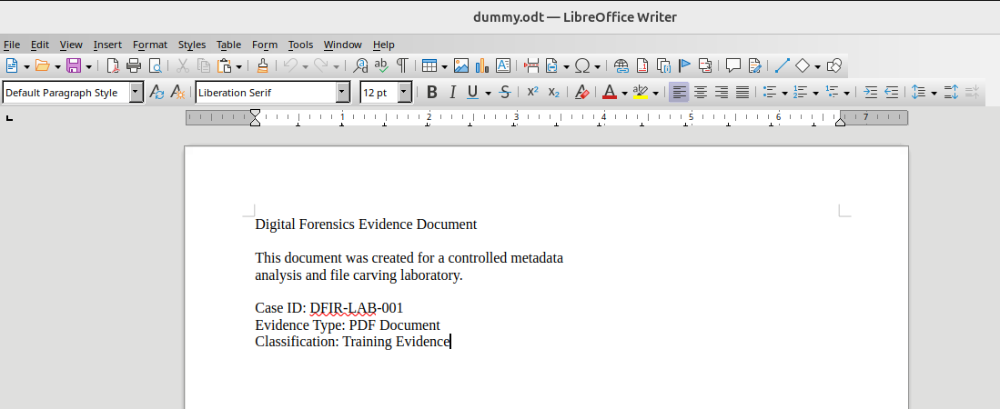
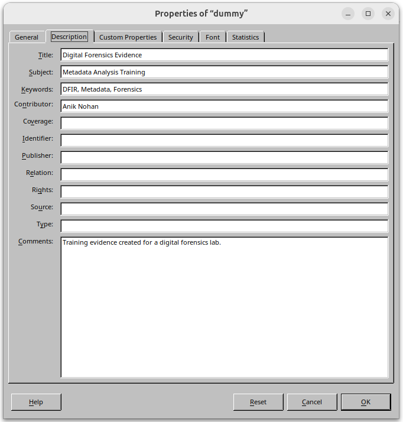
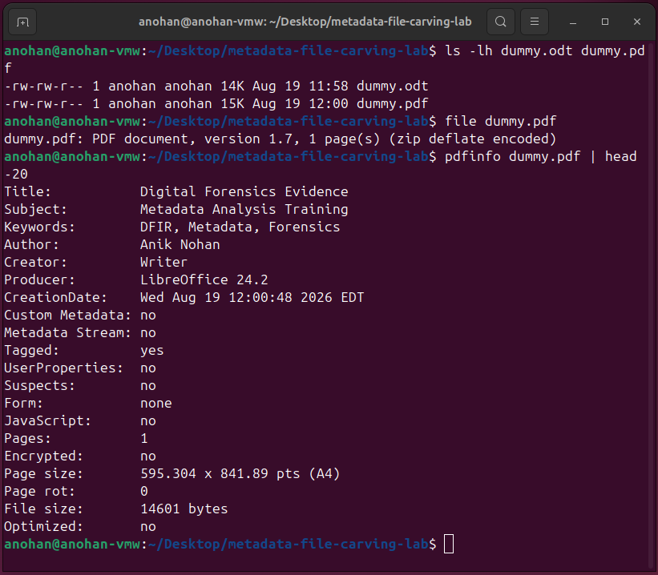
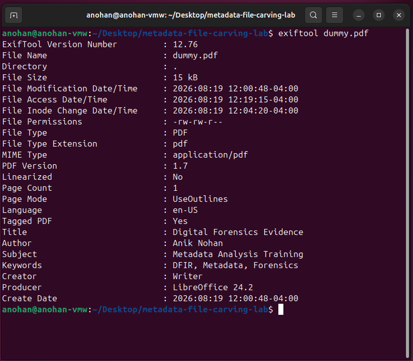

# PDF Evidence — Metadata Creation and Analysis

This section documents the creation of a controlled PDF evidence file, configuration of known metadata, verification of the exported PDF, and forensic metadata analysis using ExifTool.

The purpose of this phase was to demonstrate how document metadata can be intentionally embedded and later identified during a digital forensic examination.

---

## Step 1 — Controlled Evidence Document Creation

A controlled document was created in LibreOffice Writer for use as PDF evidence.

The document contained the following identifying information:

```text
Digital Forensics Evidence Document

This document was created for a controlled metadata
analysis and file carving laboratory.

Case ID: DFIR-LAB-001
Evidence Type: PDF Document
Classification: Training Evidence
```

Creating controlled evidence provides known values that can later be compared with the metadata extracted during forensic analysis.

### Evidence



### Analyst Note

The source document establishes the context of the evidence and confirms that the PDF used later in the investigation originated from a controlled laboratory document.

---

## Step 2 — Document Metadata Configuration

Known metadata values were configured in the document properties before the document was exported as a PDF.

The configured metadata included:

| Metadata Field | Value |
|---|---|
| Title | Digital Forensics Evidence |
| Subject | Metadata Analysis Training |
| Keywords | DFIR, Metadata, Forensics |
| Contributor | Anik Nohan |
| Comments | Training evidence created for a digital forensics lab. |

### Evidence



### Analyst Note

Known metadata was intentionally assigned to the source document. This creates a controlled baseline that can be compared with metadata recovered from the exported PDF.

---

## Step 3 — PDF Export and Metadata Verification

The controlled document was exported as:

```text
dummy.pdf
```

The source document and exported PDF were first examined using:

```bash
ls -lh dummy.odt dummy.pdf
```

The exported file type was verified using:

```bash
file dummy.pdf
```

The system identified the file as a PDF document.

Metadata from the exported PDF was then examined using:

```bash
pdfinfo dummy.pdf | head -20
```

Important metadata identified by `pdfinfo` included:

```text
Title:          Digital Forensics Evidence
Subject:        Metadata Analysis Training
Keywords:       DFIR, Metadata, Forensics
Author:         Anik Nohan
Creator:        Writer
Producer:       LibreOffice 24.2
Pages:          1
Encrypted:      no
```

### Evidence



### Analyst Note

The `pdfinfo` results confirmed that important metadata values associated with the controlled source document were preserved in the exported PDF. The file was also confirmed to be a valid, single-page, unencrypted PDF document.

---

## Step 4 — ExifTool PDF Metadata Analysis

ExifTool was used to perform a more detailed forensic examination of the PDF metadata.

The following command was executed:

```bash
exiftool dummy.pdf
```

ExifTool identified file-level and document-level metadata, including:

```text
File Name              : dummy.pdf
File Type              : PDF
PDF Version             : 1.7
Page Count              : 1
Title                   : Digital Forensics Evidence
Author                  : Anik Nohan
Subject                 : Metadata Analysis Training
Keywords                : DFIR, Metadata, Forensics
Creator                 : Writer
Producer                : LibreOffice 24.2
```

### Evidence



### Analyst Note

ExifTool independently confirmed the metadata contained within the exported PDF. The recovered Title, Subject, Keywords, Author, Creator, and Producer values demonstrate how document metadata can provide useful information about the origin and creation of digital evidence.

---

## Findings

The controlled PDF examination demonstrated that metadata embedded during document creation can remain accessible after export.

Key findings included:

- The exported evidence was successfully identified as a PDF document.
- The PDF contained one page and was not encrypted.
- The controlled Title, Subject, and Keywords were recoverable.
- Author information was present in the exported PDF.
- LibreOffice information remained visible through the Creator and Producer fields.
- Both `pdfinfo` and ExifTool independently identified relevant document metadata.
- The extracted values were consistent with the controlled metadata configured during evidence creation.

---

## Forensic Significance

PDF metadata can provide useful investigative context, including information about document authorship, creation software, timestamps, document properties, and processing history.

Metadata should not automatically be treated as proof of authorship or ownership because metadata can be modified or removed. Instead, it should be evaluated alongside other forensic evidence.

In this controlled lab, the known metadata values provided a baseline that allowed the extracted metadata to be validated against expected results.

---

## PDF Evidence Summary

| Stage | Tool / Method | Result |
|---|---|---|
| Document creation | LibreOffice Writer | Controlled evidence document created |
| Metadata configuration | LibreOffice Properties | Known metadata values embedded |
| PDF verification | `file` / `pdfinfo` | Valid PDF and metadata confirmed |
| Forensic analysis | ExifTool | Embedded PDF metadata extracted |

The PDF evidence phase successfully demonstrated the creation, preservation, extraction, and interpretation of document metadata within a controlled digital forensics workflow.

---

## Next Phase

The next phase examines metadata contained within a JPEG image using ExifTool, including EXIF information and camera-related metadata.
