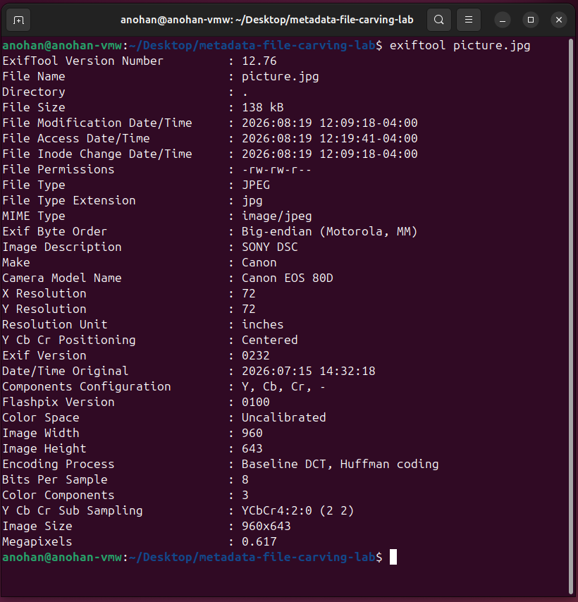

# JPEG Metadata Evidence

This section documents the forensic examination of metadata embedded within a controlled JPEG image using ExifTool.

The objective was to identify EXIF information and demonstrate how image metadata can provide useful forensic details about a digital image.

---

## Step 1 — JPEG Metadata Examination

The JPEG evidence file was examined using ExifTool:

```bash
exiftool picture.jpg
```

ExifTool identified both file-level information and embedded EXIF metadata.

Important results included:

```text
File Name              : picture.jpg
File Type              : JPEG
MIME Type              : image/jpeg
Image Description      : SONY DSC
Make                   : Canon
Camera Model Name      : Canon EOS 80D
Date/Time Original     : 2026:07:15 14:32:18
Image Width            : 960
Image Height           : 643
Image Size             : 960x643
Megapixels             : 0.617
```

### Evidence



---

## Analyst Findings

The examination confirmed that the JPEG contained recoverable EXIF metadata.

Notable findings included:

- The file was identified as a JPEG image.
- The metadata reported `Canon` as the camera manufacturer.
- The reported camera model was `Canon EOS 80D`.
- A `Date/Time Original` value was present.
- The image dimensions were identified as `960 × 643`.
- The metadata also contained the image description `SONY DSC`.

The `SONY DSC` image-description value does not match the reported Canon camera make and model. This demonstrates why forensic analysts should evaluate metadata fields critically rather than assuming that every embedded value accurately represents the origin of a file.

---

## Forensic Significance

EXIF metadata can provide investigative information such as camera make and model, timestamps, image dimensions, software information, and potentially location data when GPS metadata is present.

However, metadata can be modified, removed, copied, or become inconsistent during image processing. For this reason, EXIF information should be treated as supporting evidence and correlated with other forensic artifacts.

---

## JPEG Metadata Summary

| Field | Extracted Value |
|---|---|
| File Type | JPEG |
| MIME Type | image/jpeg |
| Image Description | SONY DSC |
| Camera Make | Canon |
| Camera Model | Canon EOS 80D |
| Date/Time Original | 2026:07:15 14:32:18 |
| Image Width | 960 |
| Image Height | 643 |
| Image Size | 960x643 |

The JPEG metadata examination successfully demonstrated the extraction and interpretation of embedded EXIF information using ExifTool.

---

## Next Phase

The next phase examines an NTFS forensic image using The Sleuth Kit to identify filesystem information and prepare for deleted-file recovery.
