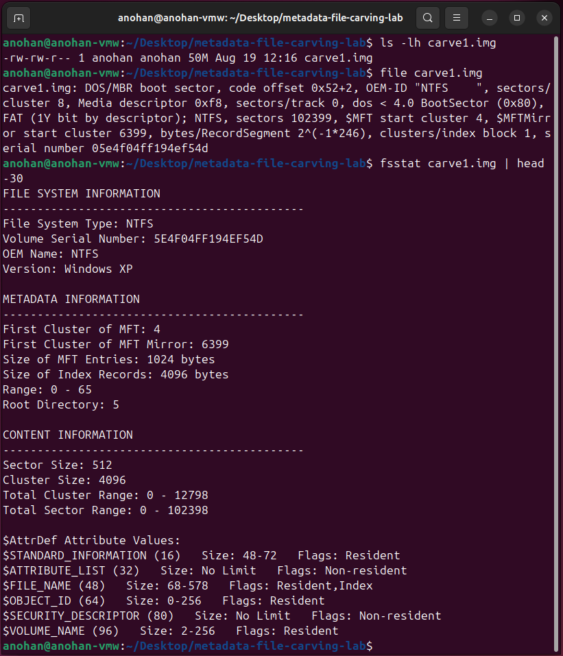

# NTFS Forensic Image Evidence

This section documents the verification and forensic examination of a controlled NTFS filesystem image using Linux file-identification utilities and The Sleuth Kit.

The purpose of this phase was to confirm that the forensic image was a valid NTFS filesystem and examine its filesystem structure before searching for deleted evidence.

---

## Step 1 — Forensic Image Verification

The controlled forensic image used in the lab was:

```text
carve1.img
```

The image file was first examined to confirm its presence and size:

```bash
ls -lh carve1.img
```

The system reported a file size of approximately:

```text
50M
```

The file type was then examined using:

```bash
file carve1.img
```

The output identified NTFS filesystem structures within the image.

This provided an initial indication that `carve1.img` contained a valid NTFS filesystem.

---

## Step 2 — NTFS Filesystem Examination

The Sleuth Kit `fsstat` utility was used to examine the filesystem structure contained within the forensic image.

The following command was executed:

```bash
fsstat carve1.img | head -30
```

The output identified the filesystem as:

```text
File System Type: NTFS
```

Important filesystem information included:

| Property | Value |
|---|---|
| File System Type | NTFS |
| OEM Name | NTFS |
| Version | Windows XP |
| First Cluster of MFT | 4 |
| First Cluster of MFT Mirror | 6399 |
| MFT Entry Size | 1024 bytes |
| Index Record Size | 4096 bytes |
| Root Directory | 5 |
| Sector Size | 512 bytes |
| Cluster Size | 4096 bytes |
| Total Cluster Range | 0 - 12798 |
| Total Sector Range | 0 - 102398 |

---

## Evidence



---

## Analyst Findings

The filesystem examination confirmed that `carve1.img` contained a recognizable NTFS filesystem that could be processed by The Sleuth Kit.

Several important filesystem characteristics were successfully identified:

- The forensic image was approximately 50 MB.
- The filesystem was identified as NTFS.
- The Master File Table (MFT) began at cluster `4`.
- MFT entries were `1024 bytes`.
- The filesystem used `512-byte` sectors.
- The filesystem used `4096-byte` clusters.
- The root directory entry was identified as `5`.
- The Sleuth Kit successfully parsed the filesystem structure.

The successful `fsstat` examination confirmed that the image was suitable for further filesystem-level forensic analysis.

---

## Forensic Significance

Filesystem analysis is an important stage of digital forensic examination because a forensic image may contain information that is no longer visible through normal operating-system file browsing.

NTFS maintains filesystem metadata within structures such as the Master File Table. These structures can retain references to files even after those files have been deleted.

Tools such as The Sleuth Kit allow an analyst to examine these filesystem structures without relying on the original operating system.

In this lab, verifying the NTFS filesystem provides the foundation for the next stage: identifying a deleted file entry and recovering its contents directly from the forensic image.

---

## Tools Used

| Tool | Purpose |
|---|---|
| `ls` | Verify the forensic image and its size |
| `file` | Identify filesystem characteristics |
| `fsstat` | Examine NTFS filesystem structure |
| The Sleuth Kit | Perform filesystem-level forensic analysis |

---

## NTFS Forensic Image Summary

The forensic image examination successfully established that:

1. `carve1.img` was present and approximately 50 MB in size.
2. The image contained an NTFS filesystem.
3. The Sleuth Kit successfully recognized and parsed the filesystem.
4. Important NTFS structures, including the MFT, were identified.
5. The image was ready for deleted-file examination and recovery.

---

## Next Phase

The next phase uses The Sleuth Kit `fls` utility to examine filesystem entries within `carve1.img` and identify the deleted JPEG evidence file.

Once the deleted file entry is identified, its metadata address can be used with `icat` to recover the file directly from the forensic image.
