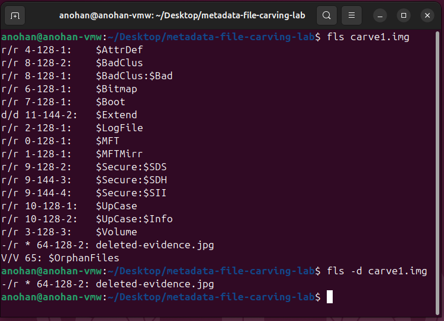
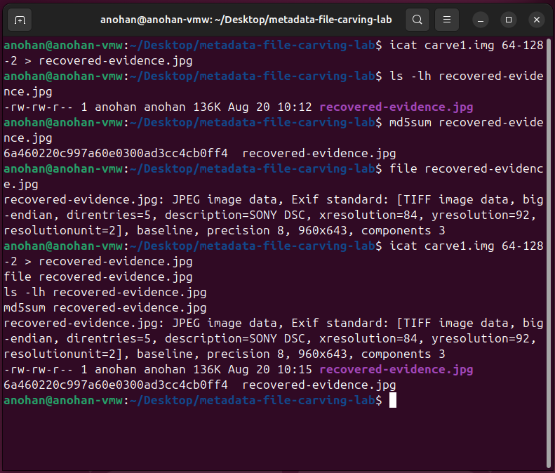
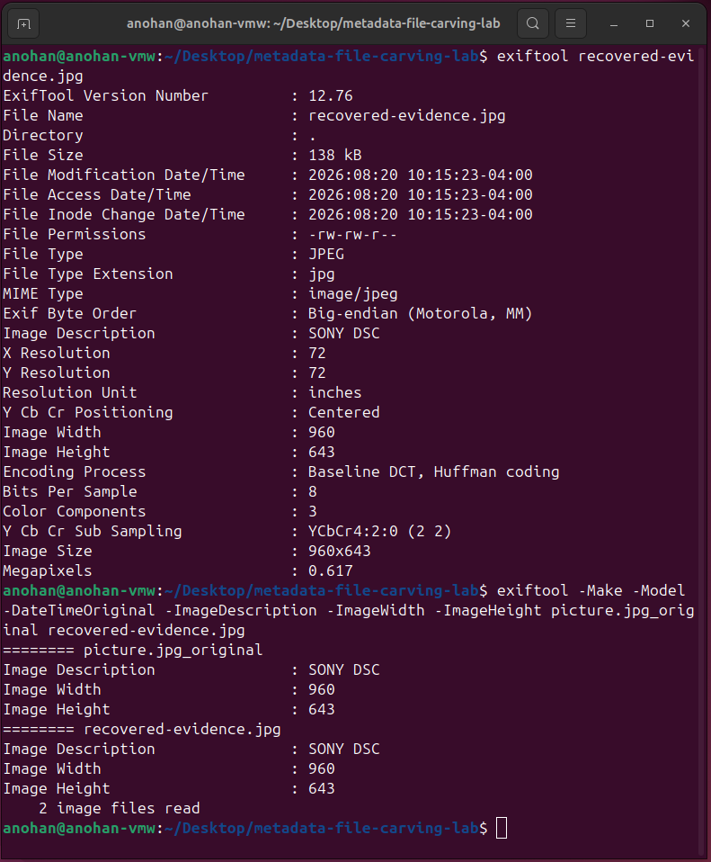

# Deleted File Recovery Evidence

This section documents the identification, recovery, and examination of a deleted JPEG file from a controlled NTFS forensic image using The Sleuth Kit.

The objective was to demonstrate a filesystem-level forensic recovery workflow in which a deleted file is identified through NTFS metadata, extracted directly from the forensic image, and examined after recovery.

---

## Step 1 — Deleted File Identification

The NTFS forensic image was examined using The Sleuth Kit `fls` utility.

The following command was used to list filesystem entries:

```bash
fls carve1.img
```

The output included the deleted JPEG file:

```text
-/r * 64-128-2: deleted-evidence.jpg
```

A deleted-file-specific listing was then performed using:

```bash
fls -d carve1.img
```

The deleted entry was again identified as:

```text
-/r * 64-128-2: deleted-evidence.jpg
```

The `*` marker indicates that the filesystem entry is deleted.

The metadata address associated with the deleted file was:

```text
64-128-2
```

### Evidence



### Analyst Note

The `fls` examination successfully identified `deleted-evidence.jpg` as a deleted NTFS filesystem entry. The metadata address `64-128-2` provided the reference required to recover the file contents directly from the forensic image.

---

## Step 2 — Deleted File Recovery

The deleted JPEG was recovered using The Sleuth Kit `icat` utility.

The following command extracted the contents associated with metadata address `64-128-2`:

```bash
icat carve1.img 64-128-2 > recovered-evidence.jpg
```

The recovered file was then examined using:

```bash
ls -lh recovered-evidence.jpg
file recovered-evidence.jpg
md5sum recovered-evidence.jpg
```

The recovered file was successfully identified as JPEG image data.

The MD5 hash calculated for the recovered file was:

```text
6a460220c997a60e0300ad3cc4cb0ff4
```

### Evidence



### Analyst Note

The successful `icat` extraction demonstrates that file contents can remain recoverable from a forensic filesystem image even after the corresponding filesystem entry has been deleted.

---

## Step 3 — Recovered EXIF Metadata Verification

After recovery, ExifTool was used to examine the recovered JPEG:

```bash
exiftool recovered-evidence.jpg
```

The recovered file contained recognizable JPEG and EXIF information, including:

```text
File Name              : recovered-evidence.jpg
File Type              : JPEG
MIME Type              : image/jpeg
Image Description      : SONY DSC
Image Width            : 960
Image Height           : 643
Image Size             : 960x643
Megapixels             : 0.617
```

Selected metadata from the original and recovered files was then compared using ExifTool.

The comparison showed matching values including:

```text
Image Description      : SONY DSC
Image Width            : 960
Image Height           : 643
```

### Evidence



### Analyst Note

The recovered JPEG remained structurally readable and retained embedded metadata after filesystem-level recovery. Matching metadata values between the original and recovered evidence provide additional support that the recovered file represents the expected image.

---

## Recovery Workflow

The deleted-file recovery process followed this sequence:

```text
NTFS Forensic Image
        |
        v
Identify Deleted Entry with fls
        |
        v
Metadata Address: 64-128-2
        |
        v
Recover File Contents with icat
        |
        v
recovered-evidence.jpg
        |
        v
Validate File Type and Metadata
```

---

## Analyst Findings

The examination established that:

- `deleted-evidence.jpg` was identified as a deleted NTFS filesystem entry.
- The deleted file was associated with metadata address `64-128-2`.
- The file contents were successfully extracted using `icat`.
- The recovered output was recognized as a valid JPEG image.
- An MD5 hash was calculated for the recovered evidence.
- EXIF metadata remained readable after recovery.
- Selected metadata values were consistent between the original and recovered JPEG.

---

## Forensic Significance

Deleting a file does not necessarily immediately destroy its underlying data.

Filesystem metadata may continue to reference deleted content, and the underlying file data may remain recoverable until it is overwritten.

The Sleuth Kit provides forensic utilities that allow analysts to examine filesystem structures and extract file contents directly from forensic images without relying on normal operating-system file recovery mechanisms.

This workflow demonstrates the importance of filesystem-level analysis when investigating deleted evidence.

---

## Tools Used

| Tool | Purpose |
|---|---|
| `fls` | Identify filesystem entries and deleted files |
| `icat` | Extract file contents using an NTFS metadata address |
| `file` | Verify the recovered file type |
| `ls` | Verify the recovered file and size |
| `md5sum` | Calculate an MD5 digest of the recovered file |
| ExifTool | Examine metadata retained in the recovered JPEG |

---

## Deleted File Recovery Summary

| Stage | Result |
|---|---|
| Deleted file | `deleted-evidence.jpg` |
| Metadata address | `64-128-2` |
| Recovery tool | `icat` |
| Recovered file | `recovered-evidence.jpg` |
| Recovered type | JPEG |
| MD5 | `6a460220c997a60e0300ad3cc4cb0ff4` |
| Image dimensions | 960 × 643 |
| Metadata retained | Yes |

The deleted-file recovery phase successfully demonstrated identification, extraction, and post-recovery examination of deleted evidence from an NTFS forensic image.

---

## Next Phase

The next phase verifies the integrity of the recovered evidence by comparing cryptographic hashes and performing a byte-for-byte comparison between the original and recovered files.
