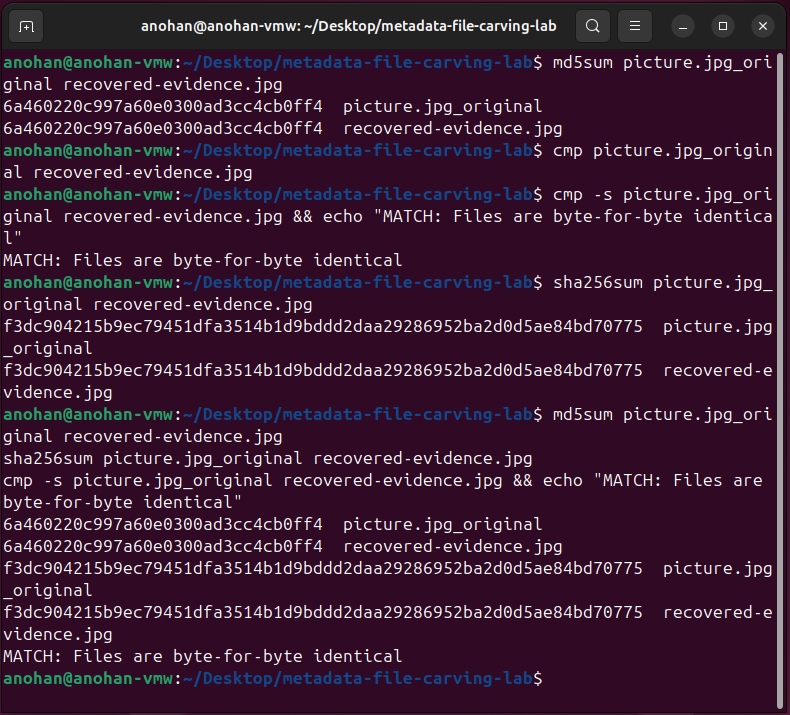

# Integrity Verification Evidence

This section documents the integrity verification of the recovered JPEG evidence and the final cryptographic hash summary for the Digital Forensics Metadata and File Carving Lab.

The objective was to verify that the JPEG recovered from the NTFS forensic image was identical to the original evidence file and to record cryptographic hashes for key forensic artifacts.

---

## Step 1 — Recovered File Integrity Verification

The original JPEG and the recovered JPEG were first compared using MD5 hashing.

```bash
md5sum picture.jpg_original recovered-evidence.jpg
```

Both files produced the same MD5 hash:

```text
6a460220c997a60e0300ad3cc4cb0ff4
```

SHA-256 hashes were also calculated:

```bash
sha256sum picture.jpg_original recovered-evidence.jpg
```

Both files produced the same SHA-256 hash:

```text
f3dc904215b9ec79451dfa3514b1d9bddd2daa29286952ba2d0d5ae84bd70775
```

---

## Step 2 — Byte-for-Byte Comparison

In addition to cryptographic hashing, the original and recovered files were directly compared using `cmp`.

```bash
cmp -s picture.jpg_original recovered-evidence.jpg && echo "MATCH: Files are byte-for-byte identical"
```

The system returned:

```text
MATCH: Files are byte-for-byte identical
```

This confirmed that the recovered JPEG was an exact byte-for-byte copy of the original evidence file.

### Evidence



### Analyst Note

Matching MD5 and SHA-256 hashes provide strong evidence that the original and recovered files contain identical data.

The successful byte-for-byte comparison provides an additional independent verification that the recovery process reproduced the original JPEG without modification.

---

## Step 3 — Final Evidence Hash Summary

A final evidence review was performed to document the primary artifacts generated and examined during the lab.

The evidence set included:

```text
carve1.img
dummy.pdf
picture.jpg_original
recovered-evidence.jpg
```

A SHA-256 hash was calculated for the recovered JPEG:

```bash
sha256sum recovered-evidence.jpg
```

The recovered evidence SHA-256 value was:

```text
f3dc904215b9ec79451dfa3514b1d9bddd2daa29286952ba2d0d5ae84bd70775
```

A SHA-256 hash was also calculated for the NTFS forensic image:

```bash
sha256sum carve1.img
```

The forensic image SHA-256 value was:

```text
ae890fcff6d26ea957702c5a4cf38b227336ddad00ae22053aa332208f62deec7
```

### Evidence


---

## Integrity Verification Results

| Artifact | Verification | Result |
|---|---|---|
| `picture.jpg_original` | MD5 | `6a460220c997a60e0300ad3cc4cb0ff4` |
| `recovered-evidence.jpg` | MD5 | `6a460220c997a60e0300ad3cc4cb0ff4` |
| `picture.jpg_original` | SHA-256 | `f3dc904215b9ec79451dfa3514b1d9bddd2daa29286952ba2d0d5ae84bd70775` |
| `recovered-evidence.jpg` | SHA-256 | `f3dc904215b9ec79451dfa3514b1d9bddd2daa29286952ba2d0d5ae84bd70775` |
| Original vs. recovered JPEG | Byte comparison | Identical |
| `carve1.img` | SHA-256 | `ae890fcff6d26ea957702c5a4cf38b227336ddad00ae22053aa332208f62deec7` |

---

## Analyst Findings

The integrity verification established that:

- The original and recovered JPEG files produced identical MD5 hashes.
- The original and recovered JPEG files produced identical SHA-256 hashes.
- A direct `cmp` comparison confirmed that the files were byte-for-byte identical.
- The deleted JPEG was therefore recovered without alteration.
- The recovered evidence retained the same underlying data as the original controlled evidence.
- A SHA-256 hash was recorded for the NTFS forensic image to provide a cryptographic identifier for the filesystem image used during the investigation.

---

## Forensic Significance

Integrity verification is a critical component of digital forensic analysis.

Cryptographic hashes provide a reproducible method for demonstrating that evidence has not changed between different stages of an examination.

If two files produce the same cryptographic hash and are also confirmed through a byte-for-byte comparison, the analyst has strong evidence that the files contain identical data.

In this lab, integrity verification demonstrated that the deleted JPEG was recovered successfully from the NTFS forensic image without modification.

---

## Tools Used

| Tool | Purpose |
|---|---|
| `md5sum` | Calculate MD5 hashes for comparison |
| `sha256sum` | Calculate SHA-256 hashes for evidence integrity |
| `cmp` | Perform direct byte-for-byte file comparison |
| `ls` | Review the final evidence files |

---

## Final Forensic Workflow

The complete laboratory workflow followed this process:

```text
Environment Preparation
        |
        v
Controlled Evidence Creation
        |
        v
PDF Metadata Examination
        |
        v
JPEG EXIF Metadata Examination
        |
        v
NTFS Forensic Image Examination
        |
        v
Deleted File Identification with fls
        |
        v
Deleted File Recovery with icat
        |
        v
Recovered Metadata Examination
        |
        v
MD5 + SHA-256 Verification
        |
        v
Byte-for-Byte Comparison
        |
        v
Evidence Integrity Confirmed
```

---

## Final Conclusion

The Digital Forensics Metadata and File Carving Lab successfully demonstrated a complete controlled forensic workflow involving metadata analysis, filesystem examination, deleted-file recovery, and evidence-integrity verification.

ExifTool was used to examine metadata from PDF and JPEG evidence. The Sleuth Kit was used to analyze an NTFS forensic image, identify a deleted filesystem entry, and recover the deleted JPEG directly from the image.

The recovered JPEG retained readable metadata and was subsequently compared with the original evidence file.

Matching MD5 hashes, matching SHA-256 hashes, and a successful byte-for-byte comparison confirmed that the recovered evidence was identical to the original file.

This lab demonstrates practical skills applicable to digital forensics and incident response, including evidence examination, metadata interpretation, filesystem analysis, deleted-file recovery, cryptographic hashing, and forensic integrity validation.
